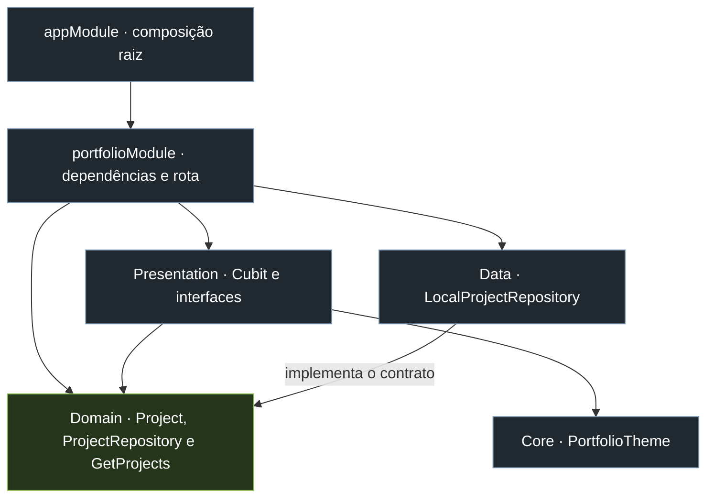
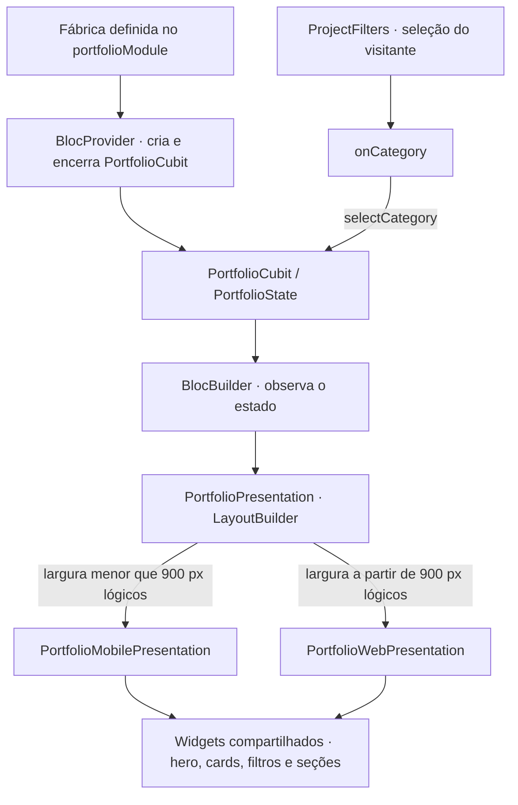
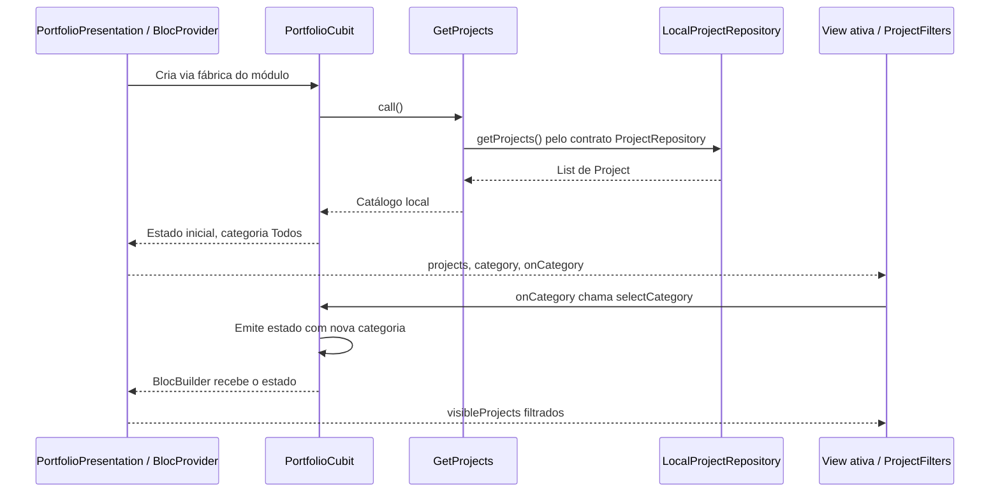

# Portfólio · Felippe Pinheiro

Aplicação Flutter para web e mobile, com visual escuro e acentos verde-lima.

## Executar

```sh
flutter pub get
flutter run -d chrome
flutter run -d <device-id>
flutter analyze
flutter test
flutter build web
flutter build apk --debug
```

## Arquitetura

O projeto segue os princípios da **Arquitetura Flutter Modular Multiplataforma** documentada por Felippe: organização por feature, Clean Architecture, Flutter Modular e Cubit/BLoC. Domínio e estado são compartilhados; as composições visuais se separam conforme o espaço disponível.

> Compartilhe comportamento. Separe representação. Separe somente aquilo que diverge.

### Estrutura da feature

```text
lib/
├── main.dart
├── app/
│   ├── app_module.dart
│   └── app_widget.dart
├── core/
│   └── theme/portfolio_theme.dart
└── modules/
    └── portfolio/
        ├── portfolio_module.dart
        ├── domain/
        │   ├── entities/project.dart
        │   ├── repositories/project_repository.dart
        │   └── usecases/get_projects.dart
        ├── data/
        │   └── repositories/local_project_repository.dart
        └── presentation/
            ├── portfolio_presentation.dart
            ├── controllers/portfolio_cubit.dart
            ├── web_presentation/portfolio_web_presentation.dart
            ├── mobile_presentation/portfolio_mobile_presentation.dart
            └── widgets/
                ├── hero_content.dart
                ├── project_card.dart
                ├── project_filters.dart
                ├── section_heading.dart
                ├── about_section.dart
                ├── experience_section.dart
                ├── contact_section.dart
                └── external_link.dart
```

### Dependências entre camadas

As setas abaixo representam dependências de código, não a ordem das chamadas em execução. O contrato do repositório pertence ao domínio; a implementação concreta pertence a dados.



O domínio não importa Flutter, dados ou apresentação. O módulo é o ponto de composição que conhece as implementações e conecta as camadas. O catálogo local permite abrir o portfólio sem consultar uma API ou expor tokens do GitHub.

### Composição responsiva e estado compartilhado



As duas views recebem apenas `projects`, `category` e `onCategory`. Não acessam o repositório nem resolvem dependências. A composição ampla usa colunas e navegação por seções; a compacta usa organização vertical, `SafeArea` e navegação inferior. Estado puramente visual, como hover, rolagem e destino da navegação mobile, fica nos respectivos widgets.

**Layout não é plataforma:** os nomes `web_presentation` e `mobile_presentation` representam as composições ampla e compacta neste projeto. Um navegador estreito usa a composição mobile; um tablet Android largo pode usar a composição web. Não existe seleção por `kIsWeb` ou `Platform.isAndroid`. O segundo `LayoutBuilder`, dentro da composição ampla, apenas calcula a largura dos cards.

### Carregamento e interação



O catálogo é carregado uma vez na criação do Cubit. Filtrar altera o estado de apresentação sem consultar novamente o repositório. Como o `BlocProvider` envolve a escolha do layout, o filtro permanece ao cruzar o breakpoint; o estado local da composição substituída pode ser reiniciado.

### Aderência à arquitetura documentada

| Princípio | Implementação atual |
| --- | --- |
| Organização feature-first | A funcionalidade está em `modules/portfolio`, com módulo próprio. |
| Domínio independente | Entidade, contrato e caso de uso são Dart sem dependências de Flutter. |
| Contrato em Domain; implementação em Data | `ProjectRepository` e `LocalProjectRepository` estão nas camadas correspondentes. |
| Compartilhar regras e estado | Um `GetProjects`, um repositório e um `PortfolioCubit` atendem às duas composições. |
| Separar somente a representação divergente | As views montam layouts diferentes e reutilizam os mesmos widgets de conteúdo. |
| Dependências e rotas por feature | `portfolioModule` registra repositório, caso de uso e rota; `appModule` compõe o módulo. |
| Core enxuto | Contém o tema global; widgets específicos continuam na feature. |
| Separação Android/iOS apenas quando necessária | Não há versões duplicadas. A abertura de links usa `url_launcher` em um helper compartilhado. |

**Adaptações e pontos de evolução:**

- **API do Modular:** o código usa `createModule`, `c.add`, `c.addSingleton` e `c.route`, da versão 7.1.0 instalada. O documento exemplifica classes com `binds` e `routes`; a responsabilidade arquitetural é equivalente, mas a sintaxe difere.
- **Ciclo de vida do Cubit:** ele não é registrado como bind. O módulo fornece a fábrica, resolve `GetProjects` e deixa criação/descarte sob responsabilidade do `BlocProvider` da tela.
- **Repositório síncrono:** `getProjects()` retorna `List<Project>`, adequado ao catálogo em memória. O exemplo documentado usa `Future<List<Project>>`. Adotar uma fonte remota exigiria adaptar o contrato, caso de uso e estado para carregamento e erro; não seria apenas trocar a classe concreta.
- **Breakpoint:** a decisão está centralizada, mas `900` ainda é literal em `PortfolioPresentation`. Extrair esse valor para a estratégia de layout/design system é o ajuste pendente em relação à recomendação do documento. Ainda não há composição intermediária específica.
- **Conteúdo editorial:** biografia, experiências e contatos estão nos widgets compartilhados. O repositório e o Cubit abrangem o catálogo de projetos e seus filtros; não todo o conteúdo do portfólio. Se esse conteúdo passar a ser dinâmico, deverá ganhar uma fonte de dados própria.

## Conteúdo e fontes

Curadoria em 06/09/2026, baseada no currículo PT-Felippe Pinheiro de Almeida.pdf e nos READMEs públicos:

- https://github.com/felippe-flutter-dev/volt_net
- https://github.com/felippe-flutter-dev/LARA_Ai_Chatbot
- https://github.com/felippe-flutter-dev/mangabrhub
- https://github.com/felippe-flutter-dev/partyu_back

Os projetos EcoEnergiza não fazem parte do catálogo de projetos pessoais. A experiência atual como Founding Mobile Engineer na EcoEnergiza consta na trajetória profissional, desde dezembro de 2025. Não foram usadas métricas de cobertura conflitantes entre currículo e README. Formação, idiomas, cargo e demais experiências vêm do currículo. As artes dos cards são composições tipográficas, não capturas dos produtos.

## Interações e validação

Filtros por tecnologia, detalhes dos projetos em diálogo, abertura de repositórios, e-mail e LinkedIn, navegação por âncoras e tratamento de falhas ao abrir links. Testes cobrem inicialização real com Modular e layouts de 320, 393, 768, 900 e 1440 px, filtros e diálogo. Testes de widget não substituem validação em dispositivos Android/iOS reais.

Não houve publicação nem configuração de domínio. O PDF original não é distribuído junto ao site.

Detalhes complementares informados por Felippe: SRM Asset com TED, assinatura via certificado digital e face scan; EyecareBI migrado de Next.js para Flutter e Oculli desenvolvido do zero. O link de Play Store enviado para ambos corresponde ao EyecareBI; não foi atribuído ao Oculli.
