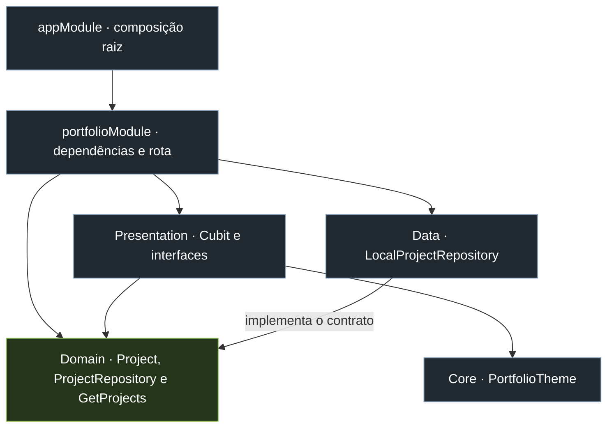
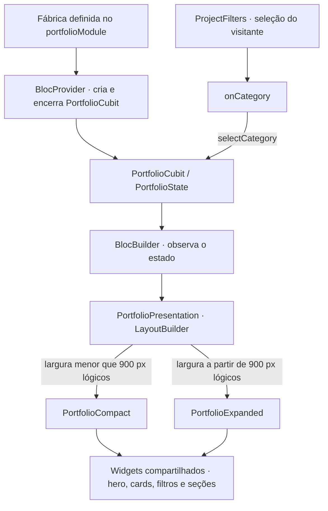

# Felippe Pinheiro · Portfólio

Portfólio profissional de **Felippe Pinheiro de Almeida**, desenvolvedor Flutter sênior. Reúne projetos pessoais, trajetória profissional e competências em desenvolvimento mobile, arquitetura de software e experiências digitais.

Desenvolvido em Flutter para Web e dispositivos móveis, o projeto aplica a **Adaptive Composition Architecture (ACA)**, convenção definida por Felippe para compartilhar comportamento, compor diferenças visuais e isolar capacidades de plataforma.

## Funcionalidades

- Catálogo de projetos com filtros por Flutter, Web e Backend.
- Detalhes técnicos dos projetos e acesso aos repositórios públicos.
- Apresentação da trajetória profissional, formação e competências.
- Seção pessoal com colagem de fotos, anotações, linha do tempo e textos no Medium.
- Player em formato de fita cassete, com reprodução, pausa, troca de faixa e avanço; letras autorais e produção via Suno.
- Animações de entrada que respeitam a preferência de movimento reduzido.
- Navegação por seções e acesso aos canais de contato.
- Composições compacta e expandida, selecionadas pelo espaço disponível.
- Identidade visual escura com componentes compartilhados e acentos verde-lima.

## Projetos em destaque

| Projeto | Foco | Tecnologias |
| --- | --- | --- |
| [Volt Net](https://github.com/felippe-flutter-dev/volt_net) | Orquestração HTTP, cache híbrido e sincronização offline | Dart, Flutter, SQLite |
| [LARA AI](https://github.com/felippe-flutter-dev/LARA_Ai_Chatbot) | Assistente com IA e personalidades adaptáveis | Flutter, Gemini, BLoC |
| [MangaBR Hub](https://github.com/felippe-flutter-dev/mangabrhub) | Plataforma de leitura de mangás | React, TypeScript, Firebase |
| [PartyU](https://github.com/felippe-flutter-dev/partyu_back) | Backend de eventos com microsserviços | Kotlin, Spring Boot, PostgreSQL |

## Stack do portfólio

| Tecnologia | Responsabilidade |
| --- | --- |
| Flutter / Dart | Interface e código compartilhado entre plataformas |
| Flutter Modular | Composição de módulos, injeção de dependências e rotas |
| BLoC / Cubit | Estado e interações da apresentação |
| LayoutBuilder | Seleção de composição por constraints locais |
| audioplayers | Reprodução de músicas na Web e no app |
| url_launcher | Abertura de repositórios e canais de contato |
| flutter_test / flutter_lints | Testes automatizados e análise estática |

## Arquitetura

> Compartilhe comportamento. Componha diferenças. Isole capacidades.

A organização é **feature-first**, com separação entre domínio, dados e apresentação. O módulo `portfolio` concentra suas dependências, seu catálogo e suas composições visuais. O diretório `core` reúne o tema e a política de breakpoints.

A [especificação da ACA](docs/architecture/aca.md) descreve os princípios da convenção. A estrutura abaixo apresenta sua aplicação neste projeto.

### Organização do código

```text
lib/
├── main.dart
├── app/
│   ├── app_module.dart
│   └── app_widget.dart
├── core/
│   ├── adaptive/app_breakpoints.dart
│   └── theme/portfolio_theme.dart
└── modules/
    └── portfolio/
        ├── portfolio_module.dart
        ├── domain/
        │   ├── entities/project.dart
        │   ├── repositories/project_repository.dart
        │   └── usecases/get_projects.dart
        ├── data/
        │   └── repositories/local_project_repository.dart
        └── presentation/
            ├── portfolio_presentation.dart
            ├── controllers/portfolio_cubit.dart
            ├── expanded/portfolio_expanded.dart
            ├── compact/portfolio_compact.dart
            └── widgets/
                ├── hero_content.dart
                ├── project_card.dart
                ├── project_filters.dart
                ├── section_heading.dart
                ├── about_section.dart
                ├── experience_section.dart
                ├── contact_section.dart
                └── external_link.dart
```

### Dependências entre camadas

O domínio define a entidade `Project`, o contrato `ProjectRepository` e o caso de uso `GetProjects`. A camada de dados implementa o contrato; a apresentação consome o domínio. O módulo conecta as dependências concretas.



As setas representam dependências de código. O domínio permanece independente de Flutter, widgets e implementações de infraestrutura.

### Composição adaptativa



`PortfolioPresentation` integra o estado à seleção do layout. As composições recebem apenas projetos filtrados, categoria selecionada e callback de filtro, reutilizando os mesmos cards e seções.

| Composição | Espaço disponível | Organização |
| --- | --- | --- |
| Compact | Menos de 900 px lógicos | Conteúdo vertical e navegação inferior |
| Expanded | A partir de 900 px lógicos | Colunas, cards em duas colunas e navegação por seções |

O breakpoint está centralizado em `AppBreakpoints.expanded`. A seleção considera a largura disponível para a feature, independentemente do sistema operacional ou do tamanho físico do dispositivo.

### Decisões de implementação

- **Estado compartilhado:** um único `PortfolioCubit` atende às duas composições. O `BlocProvider` gerencia seu ciclo de vida acima da seleção de layout, preservando o filtro ao redimensionar.
- **Catálogo local:** os projetos são carregados de um repositório em memória, sem consulta à API do GitHub durante a navegação.
- **Componentes por responsabilidade:** cards, filtros, apresentação pessoal e trajetória são compartilhados; cada composição define sua organização visual.
- **Adaptação proporcional:** existem somente as duas composições utilizadas pelo produto.
- **Integração de plataforma:** a abertura de links fica em um helper compartilhado sobre `url_launcher`, com tratamento de falhas.

## Executar localmente

Requer Flutter instalado, Dart compatível com `^3.11.4` e o ambiente configurado para a plataforma de destino.

```sh
flutter pub get
flutter run -d chrome
```

Para executar em um dispositivo ou emulador:

```sh
flutter devices
flutter run -d <device-id>
```

## Qualidade e testes

```sh
flutter analyze
flutter test
```

A suíte verifica a inicialização com Flutter Modular, filtros, diálogos e layouts de 320 a 1440 px, incluindo os limites de 899, 900 e 901 px. Também verifica preservação do filtro ao redimensionar, criação e descarte do Cubit e seleção da composição por constraints locais.

Testes com temas Android, iOS e Windows verificam a independência da escolha de layout. A execução de APIs nativas e a experiência em dispositivos reais requerem validação nas respectivas plataformas.

## Gerar builds

### Web

```sh
flutter build web
```

Saída: `build/web`.

Para testar o build, sirva essa pasta por HTTP. Na raiz do projeto, com Python instalado:

```sh
python -m http.server 8085 --bind 127.0.0.1 --directory build/web
```

Abra [http://127.0.0.1:8085](http://127.0.0.1:8085) e mantenha o terminal em execução. Abrir `build/web/index.html` diretamente por `file://` não é uma forma suportada de testar o aplicativo.

### Android — desenvolvimento

```sh
flutter build apk --debug
```

Saída: `build/app/outputs/flutter-apk/app-debug.apk`.

Para distribuição Android, configurar a assinatura de produção e gerar o artefato de release. Builds iOS requerem macOS e Xcode.

## Autor e contato

**Felippe Pinheiro de Almeida · Desenvolvedor Flutter Sênior**

[GitHub](https://github.com/felippe-flutter-dev) · [LinkedIn](https://www.linkedin.com/in/felippepinheiro-dev-flutter) · [E-mail](mailto:felippehouse@gmail.com)
