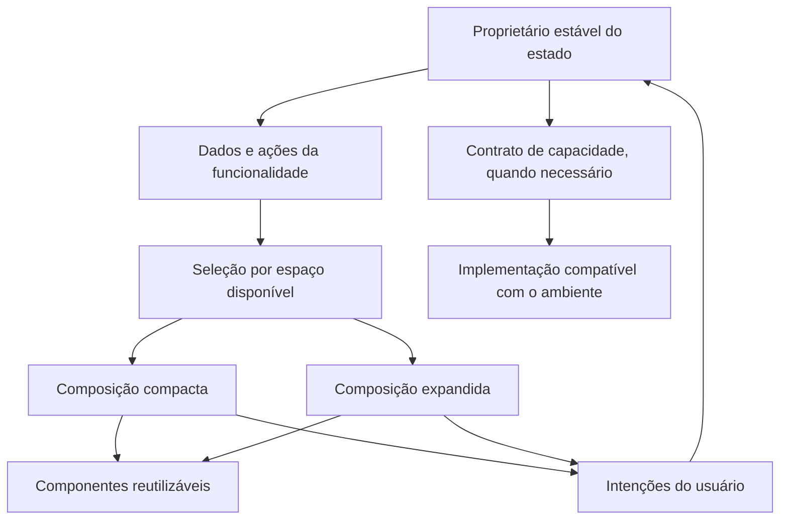
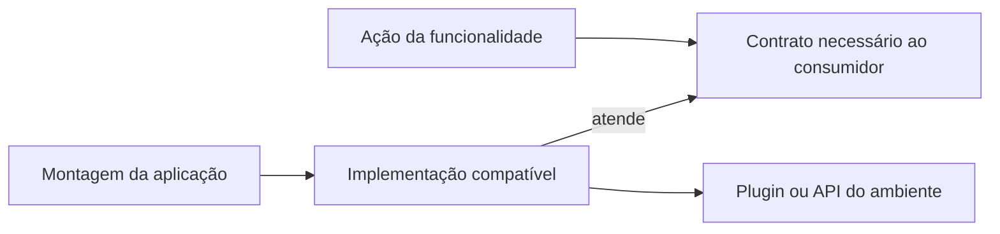

# Adaptive Composition Architecture (ACA)

> **Share behavior. Compose differences. Isolate capabilities.**
> Compartilhe comportamento. Componha diferenças. Isole capacidades.

Convenção criada por Felippe Pinheiro de Almeida para organizar interfaces adaptativas. Esta especificação distingue os princípios da ACA das escolhas de implementação do portfólio.

## 1. Escopo e independência de bibliotecas

A ACA organiza a relação entre comportamento compartilhado, composição visual e capacidades técnicas. Não é um framework, uma biblioteca de estado ou uma arquitetura completa de aplicação.

Sua adoção não exige Cubit, BLoC, Riverpod, Provider, Flutter Modular, um roteador específico ou Clean Architecture. Essas escolhas podem complementar a convenção. Também não exige camadas de domínio e dados em funcionalidades que não precisam delas.

Os exemplos e a implementação de referência usam Flutter. Os princípios podem ser adaptados a outros frameworks; isso não representa uma implementação universal nem validação empírica em outras stacks.

## 2. Princípios e critério de separação

1. **Compartilhar comportamento equivalente.** Regras, consultas, filtros e seleções da mesma funcionalidade não devem ser reimplementados por composição.
2. **Compor diferenças reais.** O espaço disponível orienta a organização visual. `compact` e `expanded` descrevem arranjos, não sistemas operacionais.
3. **Isolar capacidades.** Integrações técnicas variam conforme suporte, permissões e condições de execução, independentemente da largura.
4. **Separar no menor ponto necessário.** Extrair uma seção é suficiente quando apenas ela muda de organização.
5. **Definir propriedade e ciclo de vida do estado.** Estado que precisa sobreviver à troca de composição deve ter um proprietário estável.

| Mudança | Decisão inicial |
| --- | --- |
| Padding, cor, tamanho ou número de colunas | Manter o componente e parametrizar quando necessário |
| Organização de uma seção | Extrair as composições daquela seção |
| Relação entre lista, detalhe e navegação | Compor os arranjos necessários para a funcionalidade |
| API, permissão ou recurso do ambiente | Isolar a integração quando houver uma fronteira útil |
| Regra de negócio ou fluxo diferente | Modelar a diferença no comportamento correspondente |

ACA não proíbe condicionais, estado local ou pequenos trechos de estrutura repetidos. Uma abstração cheia de flags pode custar mais do que duas composições simples. A presença de um `if` não caracteriza, por si só, violação da convenção.

## 3. Responsabilidades e fluxo



O diagrama representa fluxo conceitual de dados e ações, não a obrigatoriedade de criar uma classe para cada caixa.

O comportamento pode estar em um ViewModel, controller, notifier, store ou objeto com streams. As composições recebem os dados e ações relevantes. Um adaptador na entrada da funcionalidade conecta a biblioteca escolhida a esse contrato.

Regras de negócio não precisam conhecer largura, widgets ou plugins. Estado de apresentação, como a seleção de um item, não precisa ser promovido a regra de domínio apenas porque é compartilhado.

## 4. Organização possível

```text
catalog/
  catalog_state.dart
  catalog_actions.dart
  presentation/
    catalog_presentation.dart
    compact/
      catalog_compact.dart
    expanded/
      catalog_expanded.dart
    widgets/
      catalog_list.dart
      catalog_details.dart
```

Esta árvore é ilustrativa. Se o projeto já concentra estado e ações em um ViewModel, preserve essa organização. Diretórios de domínio, dados, integrações ou módulos devem refletir responsabilidades reais. `medium` só existe se houver uma terceira composição necessária.

Componentes exclusivos de uma funcionalidade permanecem nela. A promoção para um design system ou área compartilhada depende de reutilização real e de um contrato estável, não apenas de semelhança visual.

## 5. Seleção e política de breakpoints

No Flutter, `LayoutBuilder` permite decidir pelas constraints locais. O tamanho da janela é apropriado quando a decisão pertence à janela inteira. Um painel estreito em uma janela larga pode continuar compacto.

A política deve registrar:

- o espaço medido, em pixels lógicos, e o ponto de medição;
- quais arranjos existem e por que a estrutura precisa mudar;
- o intervalo de cada composição, incluindo a igualdade no limite;
- como conteúdo longo, texto ampliado, altura reduzida e interação por teclado serão verificados;
- eventuais exceções por funcionalidade, com justificativa.

Escolha o limiar observando quando o conteúdo deixa de caber de forma utilizável. Não use o nome do dispositivo como medida indireta. Centralize políticas compartilhadas; não force todas as funcionalidades a ter o mesmo limiar se suas necessidades forem diferentes.

No portfólio, [AppBreakpoints](../../lib/core/adaptive/app_breakpoints.dart) define **900 pixels lógicos**: abaixo disso, compacto; a partir disso, expandido. O valor é uma escolha deste produto, não um padrão da ACA. A composição expandida organiza conteúdo em colunas e muda a navegação. Os testes atuais verificam o comportamento nesse limite; não comprovam que 900 seja o limiar ideal para todo conteúdo ou configuração de acessibilidade.

## 6. Estado, identidade e ciclo de vida

Compartilhar a classe de um controller não basta: criar uma instância em cada composição ainda pode perder estado e repetir consultas.

O proprietário do estado que precisa persistir deve ficar fora da subárvore substituída. Defina quem cria, quem observa e quem descarta essa instância. Alterar constraints não deve disparar efeitos de negócio no construtor da composição ou no callback do `LayoutBuilder`.

Estado efêmero pode continuar local: hover, expansão descartável ou animação, conforme o contrato de experiência. Seleção, rascunho, reprodução ou posição de leitura só precisam subir quando devem sobreviver à transição. Preservar dados também não preserva automaticamente foco, rolagem ou a identidade de todos os widgets; esses comportamentos exigem decisões e testes próprios.

No portfólio, o filtro do catálogo permanece porque seu `BlocProvider` está acima da decisão de layout. O player e a animação da fita têm estado local e são descartados quando a composição é substituída. Se a experiência passar a exigir áudio contínuo no redimensionamento, o proprietário da reprodução precisará de um escopo estável.

## 7. Capacidades e montagem das dependências

Uma composição pode pedir uma exportação sem saber se a implementação abre um download ou um seletor de destino. Quando essa separação for útil, o contrato expressa a necessidade do consumidor; a montagem da aplicação fornece a implementação adequada.

Isso pode ser feito por construtores, fábricas ou um contêiner existente. Não é necessário acrescentar uma biblioteca de injeção de dependências. Um plugin que já abstrai os destinos pode ser suficiente, sem uma camada que apenas repita seus métodos.

Suporte não equivale a disponibilidade: a operação pode exigir permissão, ser cancelada, ficar indisponível ou falhar depois da verificação inicial. Modele esses resultados e suas alternativas. Não presuma que a ausência de uma capacidade garante a existência de outra.

Contratos de integração pertencem à camada adequada ao consumidor; nem todo contrato precisa estar no domínio. Bibliotecas incompatíveis com um destino podem exigir imports condicionais ou outro mecanismo de seleção em compilação. Uma condição em tempo de execução não corrige necessariamente incompatibilidade de compilação.



## 8. Navegação e deep links

A ACA não substitui o roteador. Em um catálogo com detalhe, uma rota como `/catalog/itemId` pode representar a seleção canônica. Uma fronteira de navegação interpreta o identificador, resolve o item e fornece estado à funcionalidade. As composições emitem intenções como selecionar e voltar; o adaptador coordena essas intenções com o router.

Com pouco espaço, a seleção pode ocupar a área da lista. Com mais espaço, pode ocupar um painel lateral. Redimensionar deve alterar a composição sem acrescentar entradas ao histórico ou repetir o carregamento apenas por essa mudança.

Escolha uma fonte de verdade para a seleção navegável. Se houver sincronização entre rota e estado, defina sua direção e evite ciclos. Verifique abertura direta, retorno, identificador inválido, carregamento e erro. Esse cenário é orientação de adoção; o portfólio não implementa um catálogo de detalhes com esse esquema de URLs.

## 9. Testes e critérios de aceitação

Teste as composições diretamente com dados controlados e ações observáveis. Depois teste a fronteira adaptativa e a continuidade do comportamento.

```text
Dado um catálogo compacto com itens conhecidos
Quando seleciono um item
Então o detalhe corresponde ao item selecionado
Quando amplio o espaço e atravesso o breakpoint
Então a composição expandida apresenta a mesma seleção
E o proprietário do estado permanece o mesmo
E nenhuma nova consulta ocorre apenas pelo redimensionamento
```

Esse roteiro é ilustrativo, não uma declaração de cobertura existente. Para cada produto, inclua os limites imediatamente abaixo, no ponto e acima do breakpoint, constraints locais, conteúdo longo, texto ampliado e os estados vazio, carregando e erro. Também avalie foco, teclado e histórico quando forem relevantes.

Capacidades pedem testes de indisponibilidade, cancelamento e falha, além do caminho de sucesso. Testar a composição isolada não substitui a integração com o ambiente real.

## 10. Implementação de referência e limites da evidência

- [Código-fonte Flutter](https://github.com/felippe-flutter-dev/my_portifolio).
- [Portfólio publicado](https://felippe-flutter-dev.github.io/).
- [Repositório de publicação, apenas build web](https://github.com/felippe-flutter-dev/felippe-flutter-dev.github.io).

| Princípio | Implementação verificável neste projeto |
| --- | --- |
| Seleção por espaço local | [PortfolioPresentation](../../lib/modules/portfolio/presentation/portfolio_presentation.dart), com `LayoutBuilder` |
| Composições distintas | [PortfolioCompact](../../lib/modules/portfolio/presentation/compact/portfolio_compact.dart) e [PortfolioExpanded](../../lib/modules/portfolio/presentation/expanded/portfolio_expanded.dart) |
| Estado do catálogo acima da troca | `BlocProvider` em `PortfolioPresentation` |
| Política explícita | [AppBreakpoints](../../lib/core/adaptive/app_breakpoints.dart) |
| Regressões de adaptação | [portfolio_test.dart](../../test/portfolio_test.dart) |

A suíte verifica preservação do filtro Backend e uma única criação do Cubit ao redimensionar, seu descarte ao remover a apresentação, escolha por constraints locais independentemente do tema de plataforma e larguras incluindo 899, 900 e 901. Esses testes demonstram comportamentos delimitados desta implementação.

Cubit, Flutter Modular e separação de domínio/dados são escolhas do portfólio. Integrações como áudio e abertura de links utilizam plugins; não há obrigação de inventar adapters próprios para afirmar adoção da ACA.

Este é um caso de aplicação com evidências automatizadas, não prova de superioridade sobre outras convenções. Ainda não há medição comparativa de produtividade, custo de manutenção, performance ou aplicação por múltiplas equipes.

## 11. Benefícios esperados, custos e adoção

Os benefícios esperados são localizar alterações de composição, reduzir duplicação de comportamento e tornar as diferenças revisáveis. Dependem da disciplina de implementação e devem ser avaliados no contexto do produto.

Os custos incluem mais arquivos, risco de divergência entre experiências e necessidade de testar transições. Compartilhamento excessivo também produz componentes difíceis de entender. Separar arquivos não oferece ganho automático de performance.

Comece por uma funcionalidade com divergência estrutural real. Declare o que deve permanecer ao redimensionar, extraia somente os arranjos necessários e verifique os fluxos. Mantenha uma solução simples quando espaçamento, constraints ou um grid já resolvem o problema.

ACA complementa práticas de composição e separação de responsabilidades; não reivindica a invenção desses fundamentos. Seu compromisso é tornar explícito o acordo de organização da equipe.

## 12. Referências

- [Interfaces adaptativas no Flutter](https://docs.flutter.dev/ui/adaptive-responsive/general).
- [LayoutBuilder](https://api.flutter.dev/flutter/widgets/LayoutBuilder-class.html).
- [Guia de arquitetura do Flutter](https://docs.flutter.dev/app-architecture/guide).
- [Imports e exports condicionais no Dart](https://dart.dev/tools/pub/create-packages#conditionally-importing-and-exporting-library-files).

**Compartilhe comportamento. Componha diferenças. Isole capacidades. E separe apenas o que realmente precisa ser separado.**
